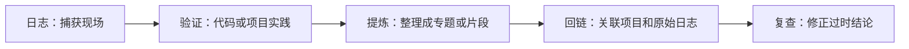

# 内容与写作说明

这套内容系统用两个维度组织信息：**主题负责检索，时间负责追踪变化**。

## 先判断内容属于哪里

| 你的内容 | 放置位置 | 典型文件 |
| --- | --- | --- |
| Python 概念、原理、长期有效的方法 | `docs/learning/` | `python-core.md` |
| 机器学习、深度学习和 AI 应用专题 | `docs/deep-learning/` | `neural-networks.md` |
| 某个项目的目标、架构、决策和复盘 | `docs/projects/` | `my-project.md` |
| 测试、打包、部署、工具和代码速查 | `docs/engineering/` | `python-engineering.md`、`snippets.md` |
| 今天学了什么、版本更新、阶段进度 | `docs/logs/posts/` | `YYYY-MM-DD-slug.md` |
| 站点规则、作者、网站更新和技术说明 | `docs/about/` | `content-and-writing.md` |
| 图片、样式和附件 | `docs/assets/` | `images/diagram.png` |

## 推荐目录

```text
docs/
├── .nav.yml                # 只管理顶部栏目
├── index.md                # 首页和主要入口
├── learning/                # 稳定的 Python 知识
│   ├── .nav.yml             # Python 侧边栏
│   ├── index.md
│   ├── python-core.md
│   └── standard-library.md
├── deep-learning/           # 机器学习、深度学习与 AI 应用
│   ├── .nav.yml             # AI 侧边栏
│   ├── index.md
│   ├── fundamentals.md
│   ├── neural-networks.md
│   ├── pytorch-and-experiments.md
│   └── ai-applications.md
├── projects/                # 每个项目一份工程档案
│   ├── .nav.yml
│   ├── index.md
│   └── project-template.md
├── engineering/             # 跨主题工程实践与代码速查
│   ├── .nav.yml
│   ├── index.md
│   ├── python-engineering.md
│   └── snippets.md
├── logs/
│   ├── .nav.yml
│   ├── index.md             # 日志聚合页
│   └── posts/               # 一篇日志一个日期文件
├── about/                   # 作者、站点规则和更新历史
│   ├── .nav.yml
│   ├── index.md
│   └── roadmap.md           # 长期学习方向
└── assets/                  # 图片、附件、自定义样式
```

## 导航管理

根目录的 `.nav.yml` 只定义首页、Python、AI、项目实践等顶部栏目。每个内容目录中的 `.nav.yml` 只负责自己的侧边栏顺序和分组。

新增普通页面后，可以在目录的 `.nav.yml` 中明确放置，也可以使用 `"*"` 通配符自动收录其余页面。这样内容增长时不需要不断扩充根目录的 `mkdocs.yml`。

## 文件命名规则

- 文件名使用小写英文和连字符：`async-io.md`。
- 日志以日期开头：`2026-08-08-learning-reflection.md`。
- 标题使用清楚的问题或主题，不使用“笔记 1”“随手记”等模糊名称。
- 图片建议放进 `docs/assets/images/<topic>/`，名称说明其内容。

## 页面元数据

普通页面最少保留标题；需要时可增加描述和状态。

```yaml
---
title: 生成器与迭代器
description: 理解惰性计算和 Python 迭代协议
status: updated
---
```

日志使用日期和分类：

```yaml
---
date: 2026-08-08
categories:
  - Python
  - 学习思考
---
```

## 从记录到知识的工作流



1. **先记日志**：快速保留问题、尝试和结果。
2. **再做验证**：用可运行代码、测试或真实项目确认结论。
3. **提炼专题**：删除过程噪音，保留解释、示例和边界。
4. **建立链接**：专题链接到项目案例，项目链接到相关知识。
5. **定期维护**：在升级 Python 或依赖版本后复查相关页面。

## 什么时候拆分页面

出现以下任一情况时，考虑把内容拆成独立页面：

- 一个页面包含三个以上互不依赖的主题。
- 页面很长，目录已经不能快速定位。
- 某个小节会被多个项目反复引用。
- 主题需要独立维护版本或验证日期。

!!! success "保持可维护的关键"

    顶部导航只展示稳定领域，不必把每篇日志和每个小片段都塞进去。日志由博客插件自动汇总，其他语言只在具体专题、项目或代码标签页中按需引用。
