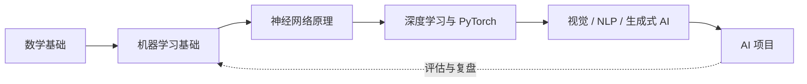

# AI 总览

AI 区围绕“理解基础、实现方法、设计实验、构建应用”组织内容。范围包括机器学习、神经网络、深度学习、计算机视觉、自然语言处理和生成式 AI；单次实验过程和项目变化写入日志或项目档案。

## 学习路径

-   :material-function-variant:{ .lg .middle } **数学与机器学习基础**

    ---

    线性代数、微积分、概率统计、损失函数、优化与模型评估。

    [进入基础部分 :octicons-arrow-right-24:](fundamentals.md)

-   :material-brain:{ .lg .middle } **神经网络与深度学习**

    ---

    从感知机、反向传播到 CNN、RNN 和 Transformer 的核心机制。

    [理解神经网络 :octicons-arrow-right-24:](neural-networks.md)

-   :material-flask-outline:{ .lg .middle } **PyTorch 与实验**

    ---

    数据、模型、训练循环、评估、复现和实验记录方法。

    [开始模型实验 :octicons-arrow-right-24:](pytorch-and-experiments.md)

-   :material-creation-outline:{ .lg .middle } **AI 应用与生成式 AI**

    ---

    计算机视觉、自然语言处理、大语言模型、检索增强、智能体与应用评估。

    [探索 AI 应用 :octicons-arrow-right-24:](ai-applications.md)

## 内容边界

- 稳定原理、AI 方法和可复用实践放在本区。
- 某次训练的指标和参数变化写入实验日志。
- 能交付或持续演进的模型放进项目实践。
- JavaScript、CUDA、C++ 等内容只在解释部署、算子或性能问题时就地引用。
