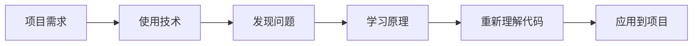

# 最近的学习好像没有太多的收获

尽管每天都进行了一定的学习，但好像自己什么都不太会呢？

<!-- more -->

## 最近的情况

我从上个月开始决定学习如何构建一个自己的 claude code 已经过去 1 个多月了，这个项目是完整结束了的。

然后我就开始学习 ts 和 python，正在使用 python 制作一个斗地主游戏。

在制作的过程中，我时常会怀疑自己的能力，认为这样的项目是否真的值得做？我知道编程水平必然是慢慢增加的，学习一门编程语言的最好方式就是制作一个简单的项目。
但实在是喜欢胡思乱想。

于是，我寻求了 codex。

## codex 给出的建议

重点是虽然每天都在学习，但是每个都不深入，每个方向都只是知道一点，应该减少并行学习的内容。

虽然不是很懂底层原理，但不建议重新开始从底层学习，不然仍是纸上谈兵，许多底层原理是需要结合项目经验进行学习的。
例如：直接学习 AQS、CAS、JMM、MVCC，最终大概率变成 -> 学习、记忆、忘记 循环。这必然会加重“每天学习但没有成就感”的恶性循环。

我和 codex 说我很喜欢 ts 这门编程语言，并且在毕业后倾向于国企就业，它给出的重点是构建起一套软件工程核心能力，而不要太在意语言的选择。
既然喜欢这门编程语言，就使用这门语言进行硬实力的提升。

所以，需要明确自己的目标：**“不是学习 TypeScript 语言，而是用 TypeScript 建立完整的软件开发能力。”**

由于我在读研究生，Python 的使用是必然的，所以这条路也必须走，但是侧重点不要和 TypeScript 一样。核心是处理数据，实现算法等方向。

Java 进行降级，但不要放弃，我之前已经使用框架写过项目，等使用 TS 搭建起来真正的工程化能力，捡起 Java 的相关技术是很轻松的！

## 自己的规划

三个月后，我能够独立设计、开发、测试和部署一个后端系统，并解释其中主要技术决策。

学习流程：

以 TS 锻炼软件工程综合能力，Python 解决数据处理、算法以及 AI ，Java 保持后端能力，不用再深入学习，后期国企求职需要的话，再提前准备则可。

重要的不是学习时长，而是可以验证的产出！只有有有质量的产出，才会有真正的成就感和满足感。
