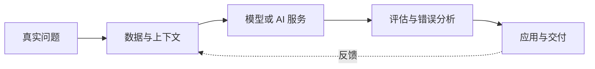

# AI 应用与生成式 AI

这一部分关注如何使用 Python 把模型能力组合成可以评估、可以维护的实际应用。内容既包括传统 AI 任务，也包括生成式 AI 和大语言模型应用。

## 内容范围

=== "感知与理解"

    - 计算机视觉：分类、检测、分割和多模态理解
    - 自然语言处理：分类、抽取、检索和文本表示
    - 语音与其他序列数据

=== "生成式 AI"

    - 大语言模型基础与提示设计
    - Embedding、向量检索和 RAG
    - 工具调用、工作流与智能体
    - 文本、图像及多模态生成

=== "应用工程"

    - 数据准备与模型服务
    - 质量评估、基准测试和错误分析
    - 成本、延迟、安全与可观测性
    - 版本迭代和生产反馈

## 推荐记录方式

AI 应用不只记录模型或提示词，还应保留：用户问题、输入输出约束、数据来源、评估集、成功标准、失败案例、成本和延迟，以及每次版本修改的依据。

