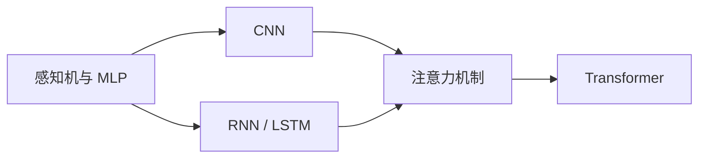

# 神经网络与深度学习

神经网络专题按照“计算过程 → 学习过程 → 架构变化”推进。

## 核心问题

1. 一层网络完成了什么变换？
2. 激活函数为什么让模型具备非线性表达能力？
3. 损失如何通过反向传播影响每一个参数？
4. 深度、宽度、归一化和残差连接分别解决什么问题？

## 架构路线

## 推荐的专题记录格式

每种网络结构至少记录：输入输出形状、核心计算、适用任务、训练特点、常见失败方式，以及一个可运行的最小实现。
