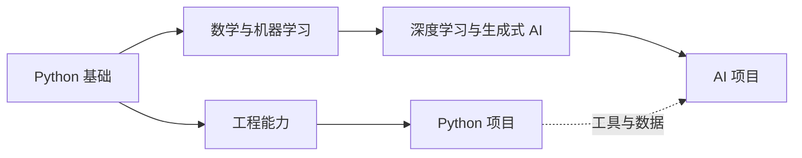

# 从 Python 基础，到能运行的真实项目

这里以 Python 为主线，记录语言知识、工程方法和完整项目过程，并延伸到机器学习、深度学习与生成式 AI。你可以跟随专题系统学习，也可以从一个真实问题或项目直接开始。

[学习 Python](learning/index.md){ .md-button .md-button--primary }
[查看项目实践](projects/index.md){ .md-button }

  
<strong>PY</strong>Python 主线

  
<strong>BUILD</strong>真实项目

  
<strong>AI</strong>智能应用

  
<strong>LOG</strong>持续更新

## 你可以在这里学到什么

-   :material-language-python:{ .lg .middle } **掌握 Python**

    ---

    理解数据类型、函数、类、迭代器、异常等语言核心，并熟悉文件、时间、集合、并发等标准库能力。

    [进入 Python 专题 :octicons-arrow-right-24:](learning/index.md)

-   :material-hammer-wrench:{ .lg .middle } **使用 Python 创建项目**

    ---

    从问题和目标出发，完成方案设计、代码实现、测试、版本迭代、问题排查和项目复盘。

    [浏览项目实践 :octicons-arrow-right-24:](projects/index.md)

-   :material-cog-outline:{ .lg .middle } **建立工程能力**

    ---

    学习类型、测试、日志、依赖管理、Git、Linux、Docker、部署和性能分析，让代码可以长期维护和交付。

    [查看工程实践 :octicons-arrow-right-24:](engineering/index.md)

-   :material-brain:{ .lg .middle } **用 Python 探索 AI**

    ---

    从机器学习和神经网络出发，学习 PyTorch、计算机视觉、自然语言处理、生成式 AI 与智能应用。

    [进入 AI 学习路径 :octicons-arrow-right-24:](deep-learning/index.md)

## 从知识到项目的两条路径

Python 是两条路径共同的基础。你既可以先建立工程能力、完成通用软件项目，也可以继续学习机器学习和神经网络，再把模型放进实际应用。

!!! info "这里不只记录最终答案"

    除了整理后的知识，网站也会保留项目为什么这样设计、遇到过什么问题、如何验证修复，以及下一次会怎样改进。目标是让每篇内容都能回到实际代码和真实场景。

## 按你的当前目标开始

=== "系统学习 Python"

    1. 从[基础与语言核心](learning/python-core.md)理解 Python 的表达方式。
    2. 根据实际任务查阅[标准库](learning/standard-library.md)。
    3. 进入[工程实践](engineering/index.md)，让代码可测试、可维护。
    4. 选择一个[项目](projects/index.md)把知识真正用起来。

=== "正在创建项目"

    1. 使用[项目记录模板](projects/project-template.md)明确目标和范围。
    2. 在项目档案中持续记录决策、里程碑和问题排查。
    3. 从[代码速查](engineering/snippets.md)寻找已经验证过的常用模式。
    4. 完成阶段目标后写一份复盘，把经验整理回专题。

=== "使用 Python 学习 AI"

    1. 先确认需要的 Python、数据处理和调试能力。
    2. 学习[数学与机器学习基础](deep-learning/fundamentals.md)。
    3. 理解[神经网络与深度学习](deep-learning/neural-networks.md)。
    4. 使用[PyTorch 与实验方法](deep-learning/pytorch-and-experiments.md)验证理解，再探索[AI 应用](deep-learning/ai-applications.md)。

## 网站内容如何持续更新

| 内容类型 | 你会看到的内容 | 更新方式 |
| --- | --- | --- |
| 专题笔记 | Python、工程实践和 AI 的稳定知识 | 理解并验证后持续修订 |
| 项目档案 | 目标、方案、代码、里程碑、故障和复盘 | 跟随项目版本演进 |
| 代码速查 | 可以直接复用的 Python 代码和命令 | 实际运行验证后收录 |
| 学习日志 | 学习进展、实验结果、项目更新和阅读记录 | 按日期持续追加 |

## 最近更新与推荐阅读

- [为什么建立这份 Python 学习记录](logs/posts/2026-08-08-site-initialized.md)
- [Python 学习总览](learning/index.md)
- [AI 学习路径](deep-learning/index.md)
- [项目记录模板](projects/project-template.md)
- [关于这个网站](about/index.md)
