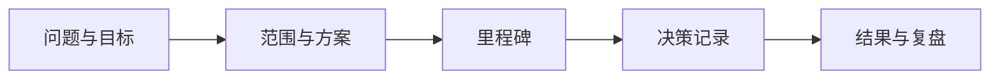

# 项目总览

项目区是一份“工程档案”，不仅展示成品，也保留目标变化、关键决策和踩坑过程。

## 项目看板

| 项目 | 状态 | 当前阶段 | 最近更新 |
| --- | --- | --- | --- |
| Python 学习手册 | :material-circle-slice-8:{ .status-active } 进行中 | 内容框架搭建 | 2026-08-08 |

## 状态约定

- :material-circle-outline:{ .status-idea } **想法**：仍在确认问题是否值得解决
- :material-circle-slice-4:{ .status-active } **进行中**：有明确的下一步和活跃开发
- :material-check-circle:{ .status-done } **已完成**：目标已达成，进入维护
- :material-archive:{ .status-archive } **已归档**：保留资料，但不再继续投入

## 一个项目，一份完整叙事

新项目可以从[项目记录模板](project-template.md)开始，建议至少保留：

