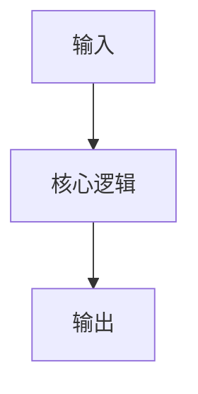

# 项目名称

> 用一句话说明：为谁解决什么问题，以及当前状态。

| 属性 | 内容 |
| --- | --- |
| 状态 | 想法 / 进行中 / 已完成 / 已归档 |
| 开始日期 | YYYY-MM-DD |
| 代码仓库 | 链接或本地路径 |
| 技术栈 | Python · ... |
| 当前版本 | v0.1.0 |

## 背景与目标

### 为什么做

描述触发项目的真实问题，而不是功能清单。

### 成功标准

- [ ] 一条可以验收的结果
- [ ] 一项质量或性能指标
- [ ] 一份必要的使用说明

## 范围

=== "本期包含"

    - 核心能力 A
    - 核心能力 B

=== "暂不包含"

    - 为控制复杂度而延期的能力

## 技术方案

记录架构图、核心模块、数据流和关键依赖。

## 决策记录

### YYYY-MM-DD · 决策标题

- **背景**：当时需要解决什么问题？
- **选择**：最终采用了什么方案？
- **理由**：为什么它比其他方案更合适？
- **影响**：带来了哪些收益、限制或后续工作？

## 里程碑

- [ ] `v0.1` — 最小可用版本
- [ ] `v0.2` — 补齐测试和文档
- [ ] `v1.0` — 稳定发布

## 问题与排查

### 问题标题

**现象 → 假设 → 验证 → 根因 → 修复 → 如何避免再次发生**

## 复盘

- 哪个决策最有效？
- 哪部分投入超出预期？
- 下次会采用什么不同做法？
- 哪些经验应该提炼到“Python 学习”专题？

<!--
使用方式：复制本文件并重命名，例如 docs/projects/my-cli.md；
删除这段注释，再把新页面加入 mkdocs.yml 的“项目”导航。
-->

