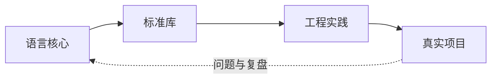

# Python 总览

Python 区只存放**经过理解和整理的长期知识**。它强调概念之间的关系，不按日期堆叠课程笔记。测试、打包、部署等跨主题内容集中放在“工程实践”。

## 学习层次

| 层次 | 关注内容 | 推荐记录方式 |
| --- | --- | --- |
| 语言核心 | 数据模型、语法、函数、类、迭代器、异常 | 概念解释 + 最小示例 + 易错点 |
| 标准库 | 文件、时间、集合、并发、网络等内置能力 | 场景索引 + API 示例 + 选择理由 |
| 工程实践 | 测试、类型、日志、打包、性能、质量 | 约定 + 工具配置 + 决策依据 |
| 项目应用 | 需求、架构、实现、发布、复盘 | 独立项目档案，并回链相关知识 |

## 当前专题

- [**基础与语言核心**](python-core.md) · Python 的表达方式与运行模型
- [**标准库**](standard-library.md) · 优先掌握随 Python 提供的工具箱
- [**工程实践**](../engineering/python-engineering.md) · 让代码可测试、可维护、可交付

## 每篇笔记建议回答

1. 这个概念解决什么问题？
2. 最小可运行示例是什么？
3. 有哪些边界、陷阱或替代方案？
4. 我在哪个项目中真正使用过它？
5. 这篇笔记最后一次验证是什么时候？
